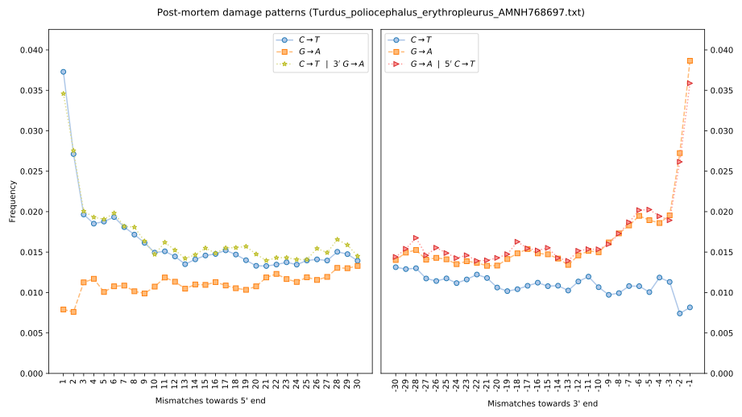
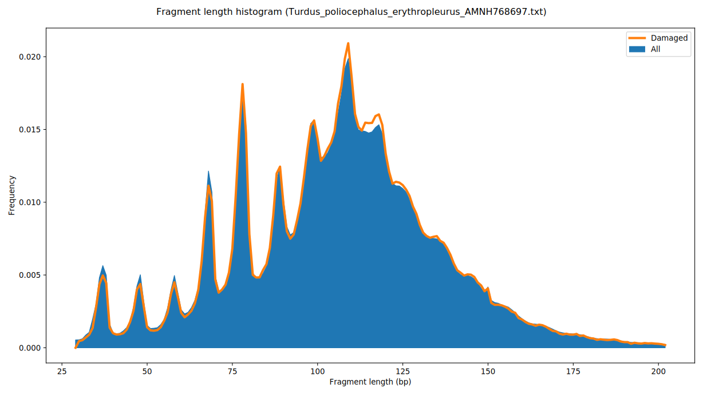

# Condamage
Score post-mortem deamination patterns. Also score patterns conditional on
deamination at the most 5' position, and patterns conditional on deamination
at the most 3' position.

Deamination of cytosines at distinct positions of a DNA molecule is thought
to be independent, so to assess possible contamination of an ancient
individual, Meyer et al. 2016, https://doi.org/10.1038/nature17405
suggested to compare the overall deamination rate of all reads
to the deamination rate conditional on having observed deamination
at the other end of the read.
These rates could differ for a contaminated specimen, because the
overall rate reflects both endogenous and non-endogenous reads,
whereas the conditional rate reflects only endogenous reads.
Similarly, fragment length distributions could vary between reads with
observations of deamination and all reads, likely indicating contamination
with non-degraded DNA.

# Prerequisites
Condamage uses **htslib** to parse bam and indexed fasta files.  The plotting
script requires **python** (tested with versions **2.7.14** and **3.6.1**) and
**matplotlib** (tested with version **2.1.0**)

# Installation
Clone the git repository, then build with `make`.

# Usage
* Ensure the reference assembly has been indexed with `samtools` to create an
`fai` file. Ie. run
```
samtools faidx ref.fasta
```

* Score the post-mortem damage patterns in `file.bam`, that was aligned to the
reference assembly `ref.fasta`.
```
condamage file.bam ref.fasta > mismatches.txt
```

* Plot the damage patterns (double stranded library).
```
plot_condamage.py -o mismatches.pdf mismatches.txt
```

* Plot the damage patterns (single stranded library).
```
plot_condamage.py -s -o mismatches.pdf mismatches.txt
```

# Example output

See [here](example/Turdus_poliocephalus_erythropleurus_AMNH768697.txt)
for an example of the `condamage` output and the resulting plots below.
This sequencing data comes from the toepad of a 70 year old museum specimen.
Note the interesting fragment length distribution, which exhibits periodic
biases in read lengths caused by preferential cleavage of DNA around
nucleosomes (this phenomenon was first reported in Pedersen et al. 2014,
https://doi.org/10.1101/gr.163592.113).
From the plots we conclude that this sample has negligible contamination
from modern DNA sources.




